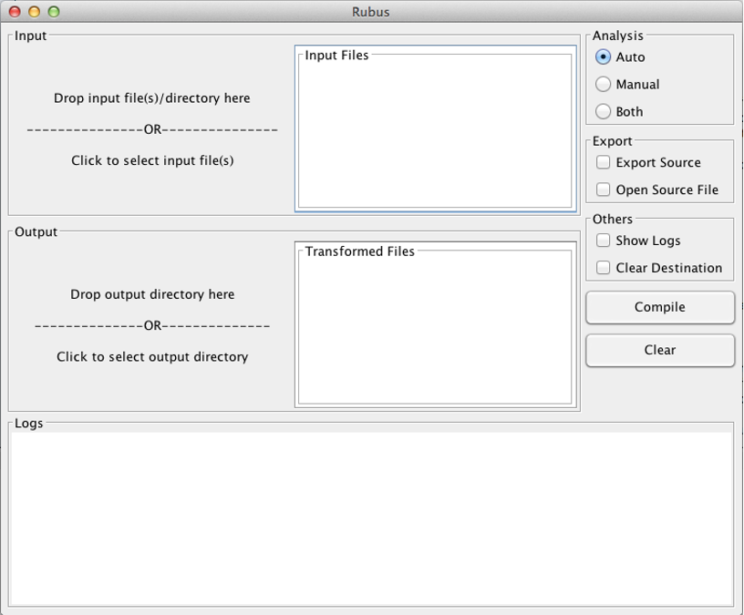

**Rubus: A compiler for seamless and extensible parallelism**

**Journal**

*PLOS ONE* https://journals.plos.org/plosone/article?id=10.1371/journal.pone.0188721

**Abstract**

Nowadays, a typical processor may have multiple processing cores on a single chip. Furthermore, a special purpose processing unit called Graphic Processing Unit (GPU), originally designed for 2D/3D games, is now available for general purpose use in computers and mobile devices. However, the traditional programming languages which were designed to work with machines having single core CPUs, cannot utilize the parallelism available on multi-core processors efficiently. Therefore, to exploit the extraordinary processing power of multi-core processors, researchers are working on new tools and techniques to facilitate parallel programming. To this end, languages like CUDA and OpenCL have been introduced, which can be used to write code with parallelism. The main shortcoming of these languages is that programmer needs to specify all the complex details manually in order to parallelize the code across multiple cores. Therefore, the code written in these languages is difficult to understand, debug and maintain. Furthermore, to parallelize legacy code can require rewriting a significant portion of code in CUDA or OpenCL, which can consume significant time and resources. Thus, the amount of parallelism achieved is proportional to the skills of the programmer and the time spent in code optimizations. This paper proposes a new open source compiler, Rubus, to achieve seamless parallelism. The Rubus compiler relieves the programmer from manually specifying the low-level details. It analyses and transforms a sequential program into a parallel program automatically, without any user intervention. This achieves massive speedup and better utilization of the underlying hardware without a programmer’s expertise in parallel programming. For five different benchmarks, on average a speedup of 34.54 times has been achieved by Rubus as compared to Java on a basic GPU having only 96 cores. Whereas, for a matrix multiplication benchmark the average execution speedup of 84 times has been achieved by Rubus on the same GPU. Moreover, Rubus achieves this performance without drastically increasing the memory footprint of a program.

**Prerequisites**

**Download and install the following software.**

1. **OpenCL Drivers:** [https://software.intel.com/en-us/articles/opencl-drivers](https://software.intel.com/en-us/articles/opencl-drivers)
2. **Java 1.7 (1.8 is not fully supported):** [http://www.oracle.com/technetwork/java/javase/downloads/java-archive-downloads-javase7-521261.html](http://www.oracle.com/technetwork/java/javase/downloads/java-archive-downloads-javase7-521261.html)
3. **Apache Ant** : [https://ant.apache.org/bindownload.cgi](https://ant.apache.org/bindownload.cgi)

**Project Structure:**

libs # Dependent Jar files

samples # Code samples (Java / Transformed / Transformed Decompiled)

src # Rubus source code

LICENSE # License

build.xml # Ant build script

**How to build:**

1. Extract rubus.zip to some directory.
2. Open Terminal app (linux/mac) or Command Prompt in Windows
3. Navigate to the rubus folder (having build.xml file)
4. Type **ant** and press enter. Make sure that apache ant is already in your system path and accessible by terminal / command prompt
5. Build process will be started and Rubus.jar will be generated in **&quot;dist&quot;** folder and dependent lib folder will also be copied there.

**How to use Rubus:**

Rubus is compiled into a single Jar file in dest folder using build.xml. Rubus can be used from command line or with GUI interface.

**Command Line interface:**

The command line interface has a number of optional arguments.

Syntax:

**java Rubus [options...] arguments...**

Arguments contains input files and destination dir.

Example:

java Rubus --dist \&lt;Output Dir\&gt; -auto -clean -debug -export -manual -open -path \&lt;Input Files\&gt;

Possible Options for are as follow:

-auto #If -auto flag is given, Rubus will perform automated analysis.

-manual #If -manual flag is given, Rubus will perform annotation based analysis.

-clean #Destination folder will be deleted before transformation.

-debug #Rubus will show all log messages.

-export #Export generate kernel and executor Java code.

-open #Open generated source file after transformation.

--dist #Destination path to export transformed code.

--path #Class path to search class files from. All path should be separated by comma &#39;,&#39;.

After options, all class and Jar files should be given, separated by the comma. To perform both auto and manual analysis, both -auto and -manual flags should be given.

All available arguments can be printed to the console using &quot;Rubus.jar -help&quot; command.

**Graphical User Interface:**

Graphical User Interface may be launched by double clicking on Rubus.jar. Alternatively, it can be run from command line using **java Rubus** command. All commandline options are also available in GUI environment.

You may drag input file(s) on &quot; **Input&quot;** area of the gui or click on input area to show a file picker.

Drag destination directory on **&quot;Output&quot;** area of the gui.

Select analysis type, Manual/Auto or Both.

If you want to export the source, check the &quot; **Export Source&quot;** checkbox.

If you want to open the exported source file, check the &quot; **Open Source File&quot;** checkbox.

To delete all files from destination directory before transformation, check &quot; **Clear Destination**&quot; checkbox.

To show logs in **&quot;Logs&quot;** area, check the **&quot;Show Logs&quot;** checkbox.

To apply transformation, Click &quot; **Compile**&quot;.

To reset the GUI, click &quot; **Clear**&quot;.

If any loop is expected for transformation, transformed class file will be generated in destination dir.

Note that the generated code use javacl to access OpenCL apis from java, thus a jar file **&quot;javacl-core-1.0.0-RC3-shaded.jar&quot;** must be in the class path to run the generated code. It is available in **libs** folder.

Detailed logs will be generated in a file named rubus.log that would be created automatically besides the Rubus.jar in dist folder.
